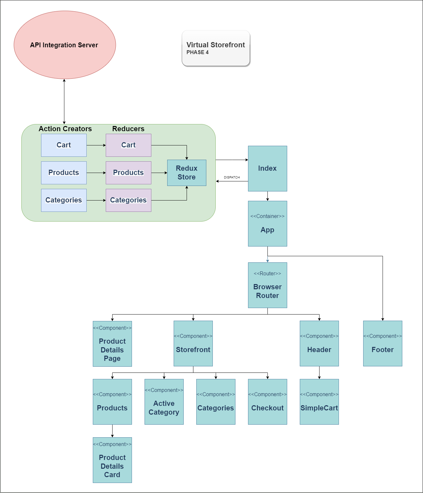

# Virtual Storefront

This application is an online storefront that allows users to browse product offerings by category, place items in their shopping cart, and check-out when they are ready to make their purchase.

## Requirements

### Phase 1 Application Setup

* Users will be able to see a list of available product categories in the store so that they can easily browse products
* Users will be able to choose a category and see a list of all available products matching that category
* Users will be presented with an easy to use user interface so that they can shop the online store with confidence

------------

### Deployment

  _Live application code found [here](https://virtual-store-front.netlify.app/)_

  <!-- _The server used for API Integration can be found [here]()_ -->
  
### Diagram

