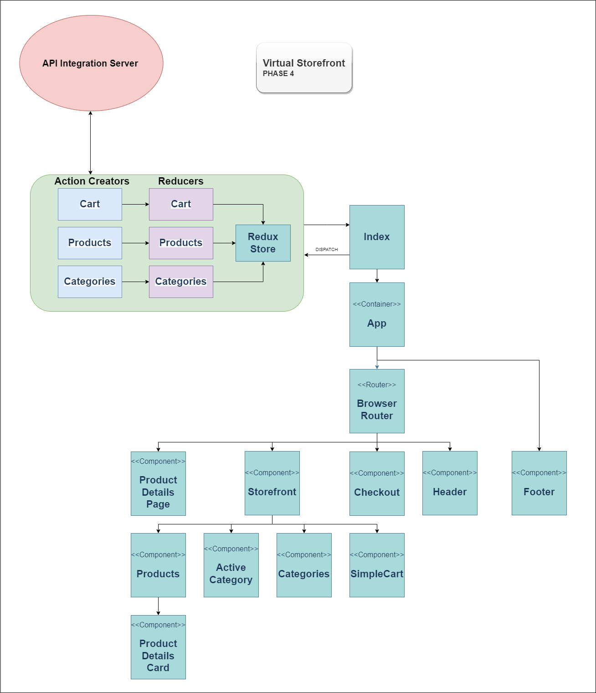

# Virtual Storefront

This application is an online storefront that allows users to browse product offerings by category, place items in their shopping cart, and check-out when they are ready to make their purchase.

## Requirements

### Phase 1 Application Setup

* Users will be able to see a list of available product categories in the store so that they can easily browse products
* Users will be able to choose a category and see a list of all available products matching that category
* Users will be presented with an easy to use user interface so that they can shop the online store with confidence

### Phase 2 Shopping Cart

* Users will be able to add products to their shopping cart
* Users will be able to update the quantities of each product in their cart
* Users will be able to remove products from their cart

### Phase 3 Live Data

* A user will be able to interact with a live inventory so that they can have confidence that the displayed products are in stock

* A user will be able to know that when they add items to their cart, an item is removed from the overall stock so that no other users can purchase it

### Phase 4 Checkout and Details Pages

* Users will be able to see a full detail view of a product so that they can make a more informed choice about 'purchasing' it

* Users will be able to view their full cart and initiate the checkout process so that I can 'purchase' their selected products and have them 'delivered'

------------

### Deployment

  _Live application code found [here](https://virtual-storefront.netlify.app/)_

  <!-- _The server used for API Integration can be found [here]()_ -->
  
### Diagram

